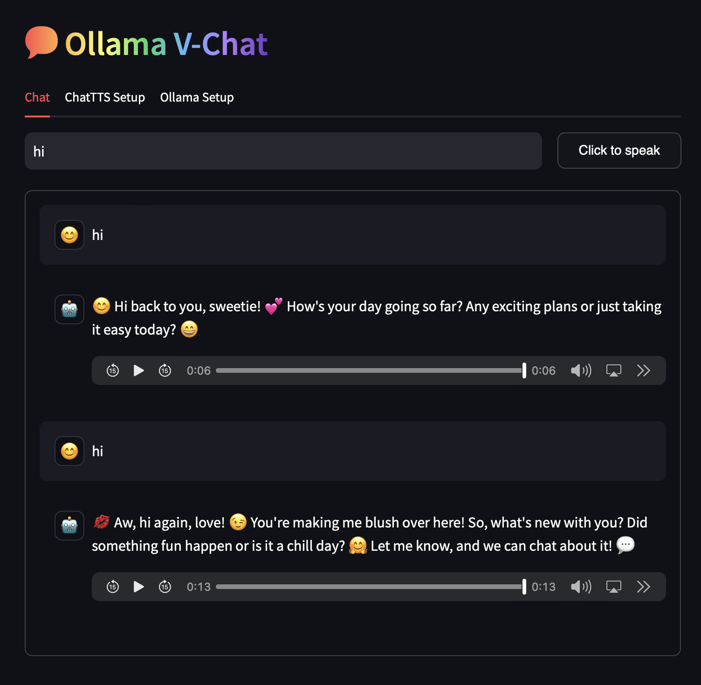

<div align="center">
</br>

</br>
</div>


[中文](./README.md) ｜ ENGLISH

Ollama ChatTTS is an extension project that is integrated with the ChatTTS, ChatTTS WebUI, and API projects. It utilizes the API functionalities of ChatTTS and employs Streamlit as the frontend library for the web interface.

<div align="center">

</div>

## UPDATE:

### 1.0.1 
1. Adding ChatTTS Setting， Now you can change tones, oral style, add laugh, adjust break
2. Adding Text input mode， just like a Ollama webui

### 1.0.0
1. Support Audio input
2. Support Ollama server setting and model setting
3. Support Lang setting（You lang）


## INSTALLATION

1. [Download Ollama](http://ollama.com)
2. Download a LLM Models，you can replace "phi3" to download others，[Model list](https://ollama.com/library)
   
   ```bash
   ollama pull phi3
   
4. [Download ChatTTS](https://github.com/2noise/ChatTTS) 
5. [Download ChatTTS Models and config](https://huggingface.co/2Noise/ChatTTS) from huggingface，put in to folder asset and config
6. [Download ChatTTS Webui](https://github.com/jianchang512/ChatTTS-ui/) and put into same folder
7. Download this project, (mainly ollamaChatTTS.py, llmChat.py, voice.py )
8. Install requirements

   ```bash
   pip install -r requirements.txt

## 启动次序：

1. Launch Ollama，and makesure running by visit http://127.0.0.1:11434
2. Double click run.bat (windows) to launch ChatTTS Webui, you can check it on http://127.0.0.1:9966

   ```bash
   python app.py

3. Final step: launch Ollama ChatTTS

   ```bash
   Streamlit run ollamaChatTTS.py
